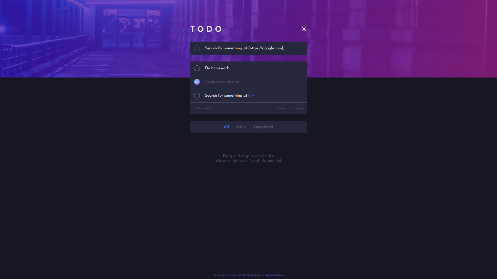

# Frontend Mentor - Todo app solution

This is a solution to the [Todo app challenge on Frontend Mentor](https://www.frontendmentor.io/challenges/todo-app-Su1_KokOW). Frontend Mentor challenges help you improve your coding skills by building realistic projects.

## Table of contents

-   [Overview](#overview)
    -   [The challenge](#the-challenge)
    -   [Screenshot](#screenshot)
    -   [Links](#links)
-   [My process](#my-process)
    -   [Built with](#built-with)
    -   [What I learned](#what-i-learned)
-   [Author](#author)

## Overview

### The challenge

Users should be able to:

-   View the optimal layout for the app depending on their device's screen size
-   See hover states for all interactive elements on the page
-   Add new todos to the list
-   Mark todos as complete
-   Delete todos from the list
-   Filter by all/active/complete todos
-   Clear all completed todos
-   Toggle light and dark mode
-   **Bonus**: Drag and drop to reorder items on the list
-   **Custom bonus**: Add links to the todo

### Screenshot



### Links

-   [Solution](https://www.frontendmentor.io/solutions/todo-app-with-possibility-to-add-links-to-todos-ZNkvf0VpBk)
-   [Live site](https://mateuszhladky.netlify.app/projects/todo-app/)

## My process

### Built with

-   Semantic HTML5 markup
-   SCSS preprocessor
-   Flexbox
-   Mobile-first workflow
-   JavaScript
-   [Sortable JS](https://github.com/SortableJS/Sortable)
-   [URL regex](https://www.npmjs.com/package/url-regex)

### What I learned

In this project I mainly learnt how to work with local storage and how to integrate it with DOM.

```js
localStorage.setItem(
    'todos',
    JSON.stringify([
        ...JSON.parse(localStorage.getItem('todos') || '[]'),
        {
            text: `${(() => {
                const charArray = Array.from(this.text);
                // Checking if link is included in todo and processing the string later
                if (charArray.includes('{') && charArray.includes('}')) {
                    const startIndex = charArray.indexOf('{');
                    const endIndex = charArray.indexOf('}');
                    if (startIndex > endIndex) return this.text;
                    if (charArray[endIndex + 1] === undefined) return this.text;

                    const charArrayWithoutEnd = charArray.slice(
                        0,
                        endIndex + 1
                    );
                    let text = '';
                    charArrayWithoutEnd.forEach(char => (text += char));

                    this.text = text;
                    return this.text;
                } else {
                    return this.text;
                }
            })()}`,
            active: this.active,
        },
    ])
);
```

## Author

-   Website - [Mateusz Hladky](https://mateuszhladky.netlify.app)
-   Frontend Mentor - [@matibox](https://www.frontendmentor.io/profile/matibox)
-   Twitter - [@m4t1box](https://www.twitter.com/m4t1box)
